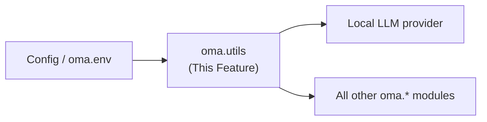

---
tags:
  - documentation
  - oh-my-agent
  - knowledge-curation
---

## Status

- **Lifecycle:** Planned. **Last reviewed:** 2026-05-19. Follows `Oh My Agent - Design Principles.md`.
- Adopts datasmith's two highest-leverage cross-cutting conventions verbatim: **every tunable knob is an `OMA_`-prefixed env override** (datasmith's `DATASMITH_` rule), and the **provider abstraction must detect rate-limit/budget signals** (datasmith built `agents/rate_limit` after this bit it).

## Abstract

`oma.utils` is the shared layer: config/env loading, the session-id codec, the local-LLM provider abstraction (the bridge between an adapter and the model used for distillation), and logging. The `ds.utils` analog: small, depended on by everything.

## High level overview



## Modules

* `oma.utils.config`: Loads `oma.env`; typed config; **the tunable-constant convention** (below). Read by `preflight.py`.
* `oma.utils.sid`: Session-id codec — `new()`, `is_valid(s)`, `format/parse(s)`.
* `oma.utils.provider`: Local-LLM provider abstraction + rate-limit detection.
* `oma.utils.log`: Structured logging; owns the `[DEBUG]`/`[INFO]` prefixes the transcripts/tests rely on.

## Tunable-constant convention — **Settled (datasmith, verbatim)**

datasmith's CLAUDE.md mandates: *any module-level knob (timeout, retry, cap, window, concurrency, threshold) must be overridable from env without a code change*, `DATASMITH_`-prefixed and greppable. `oma` adopts this as `OMA_`:

```python
import os
OMA_DISTILL_TIMEOUT_S: int = int(os.environ.get("OMA_DISTILL_TIMEOUT_S", "600"))
OMA_TRACE_MAX_BYTES: int = int(os.environ.get("OMA_TRACE_MAX_BYTES", str(2 * 1024 * 1024)))
OMA_CROSSDISTILL_WINDOW_DAYS: int = int(os.environ.get("OMA_CROSSDISTILL_WINDOW_DAYS", "30"))
OMA_INJECT_PREVIEW_HEAD_TOKENS: int = int(os.environ.get("OMA_INJECT_PREVIEW_HEAD_TOKENS", "100"))
OMA_INJECT_PREVIEW_TAIL_TOKENS: int = int(os.environ.get("OMA_INJECT_PREVIEW_TAIL_TOKENS", "100"))
OMA_CURATOR_MODE: str = os.environ.get("OMA_CURATOR_MODE", "auto")          # local | server | auto
OMA_CURATOR_SERVER_URL: str = os.environ.get("OMA_CURATOR_SERVER_URL", "")  # hosted curator endpoint
OMA_RATING_PROMPT: bool = os.environ.get("OMA_RATING_PROMPT", "1") != "0"   # ★ prompt on/off (unrated always valid)
OMA_REUSE_WEIGHT: float = float(os.environ.get("OMA_REUSE_WEIGHT", "1.0"))  # downstream-reuse weight (the default baseline signal)
```

`oh_my_agent/__init__.py` loads `oma.env` at import (like datasmith's `dotenv.load_dotenv`). Scope: *tunable* knobs only — protocol field names, schema columns, on-disk paths stay literals. This is why `oma.distill` prompts, `oma.capture` size budgets, scrub patterns, and `oma.cli` `OMA_NONINTERACTIVE` are all env-overridable.

## Session-id codec — **Settled**

8 chars, shown as `XXXX-XXXX` (`CMA1-FJ2P`). Crockford Base32 (`0-9A-Z` minus `I L O U`): case-insensitive, no ambiguous chars, URL-safe; ~40 bits, and `new()` still does a Bank existence check (collision-safe). `parse()` normalizes lowercase / missing hyphen; `is_valid()` validates canonical form (used by `oma.core.Session`). datasmith identity rule applies: this is a real key, never a derived string.

## Local-LLM provider — **provider resolution Settled; rate-limit detection Open**

Lets `oma.distill` use the *user's* model without `oma` hosting inference. `oma` ships **no** keys.

```python
class Provider:
    def complete(self, prompt: str, *, max_tokens: int | None = None) -> str: ...
    def rate_limit_signal(self, raw_error: str) -> "RateLimit | None":
        """Detect provider budget/limit exhaustion + reset time. Open."""
```

Resolution order — **Settled**: adapter `distill_model()` hook → configured fallback (`OMA_LLM_BASE_URL/API_KEY/MODEL`, OpenAI-compatible) → **hard error** (never silent skip; asserted in `oma.distill`).

**Rate-limit detection — Open (datasmith built a module for this).** datasmith's `agents/rate_limit` parses per-CLI signals (Codex human-readable reset string; Claude structured `rate_limit_event` with epoch `resetsAt`). `oma`'s provider is the natural home for the equivalent: each provider/adapter maps its raw error to a `RateLimit` (retry-after) so `oma.distill` can pause/checkpoint instead of corrupting a packet. Unresolved: the per-provider signal map. Named now because datasmith proves it is not optional at scale.

## Operations & recovery

- Config precedence — **Settled**: CLI flag > env > `oma.env` > default, implemented once here so CLI and API agree.
- `OMA_`-prefix means every operational knob is greppable in code and shell — the lever ops uses for incident response (datasmith §8).

## Verification

* **Unit:** `sid.new()` 10k unique + valid; `parse()` normalizes lowercase/missing-hyphen; `is_valid()` rejects bad length/alphabet (`I L O U`)/grouping. Config precedence per layer. `provider.resolve()`: adapter hook → wrap; fallback configured → build; neither → documented error. `rate_limit_signal()` parses canned Codex/Claude rate-limit payloads into a correct retry-after. `log` emits the exact `[DEBUG]`/`[INFO]` prefixes.
* **Integration:** `sid.new()` consults mock Bank, retries forced collision; provider fallback hits a stubbed OpenAI-compatible endpoint with the configured model.

## Decision log

- **2026-05-19 — Adopted datasmith's tunable-constant rule as `OMA_`.** Concrete, high-leverage; was entirely absent from the first draft (Design Principles §8).
- **2026-05-19 — Added `Provider.rate_limit_signal` seam, marked Open.** Direct precedent: datasmith `agents/rate_limit` (Design Principles §5). Remains Open (Open-Questions §B "rate-limit mid-run").
- **2026-05-19 — Registered the resolution-pass tunables** (`OMA_CROSSDISTILL_WINDOW_DAYS`, `OMA_INJECT_PREVIEW_HEAD/TAIL_TOKENS`) as canonical `OMA_`-prefixed knobs.
- **2026-05-19 (swarms-alignment) — Added curator/rating tunables:** `OMA_CURATOR_MODE` (`local|server|auto`) + `OMA_CURATOR_SERVER_URL` (hybrid curator, `oma.distill`); `OMA_RATING_PROMPT` (★ on/off; unrated always valid regardless); `OMA_REUSE_WEIGHT` (downstream-reuse, the default baseline weight). The provider abstraction resolves a *curator* target the same way it resolves a distill model: adapter/local model for `local`, the `OMA_CURATOR_SERVER_URL` endpoint for `server`.
</content>
