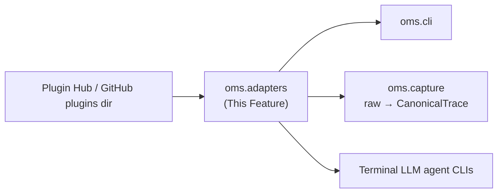

---
tags:
  - documentation
  - oh-my-swarm
  - knowledge-curation
---

## Status

- **Lifecycle:** Planned — the primary extension point.
- **Last reviewed:** 2026-05-19. Follows `Oh My Swarm - Design Principles.md`.
- **Validated by datasmith, not just asserted:** datasmith went Codex-only → multi-agent auto-detect (Claude/Codex/Gemini/Qwen) via an explicit `get_agent()`/`InstalledAgent` abstraction. An explicit adapter ABC + registry is the design that *survived* contact (Design Principles §4, §5). Keep it; this doc records *why* it's right.

## Abstract

`oms.adapters` is the agent adapter/plugin system. An *adapter* is the small object-oriented integration that lets `oms` source a session's trace and inject context for a specific terminal agent. It produces **raw** material only; normalization/bounding/scrubbing is `oms.capture`'s job (Design Principles §2 — keep adapters dumb so the public corpus isn't only as safe as the worst third-party plugin).

## High level overview



## Modules

* `oms.adapters.base`: The `Adapter` ABC — the whole contract: `invoke()`, `capture()`, `inject()`, `retrieve()`, optional `distill_model()`, plus identity metadata.
* `oms.adapters.registry`: Local discovery + plugin-hub fallback (`oh-my-swarm.org/plugins/<name>`).
* `oms.adapters.builtin`: First-party `claude`, `codex`, `gemini`, `qwen` — reference impls and the smallest examples for contributors.

## Design Decisions

### Adapter (code) vs. Agent (record) — **Settled**

`Adapter` = stateless pluggable code for one CLI; `Agent` (`oms.core`) = a registered instance in one session. datasmith's surviving split (models vs. behavior) directly.

### The four-method contract — **Settled**

```python
class Adapter(ABC):
    name: str; binary: str; version: str
    @abstractmethod
    def invoke(self, args: list[str]) -> "session-attached subprocess": ...
    @abstractmethod
    def capture(self) -> "RawTrace":
        """Return RAW session material (native log or PTY bytes). Normalization,
        size-bounding, and SECRET SCRUBBING are NOT done here — oms.capture owns
        that, centrally and uniformly."""
    @abstractmethod
    def inject(self, context: str) -> None: ...
    @abstractmethod
    def retrieve(self) -> str | None: ...
    def distill_model(self): ...   # optional: expose the agent's own model to oms.distill
```

`capture()` returning *raw* (not a distilled or scrubbed result) is the load-bearing decision: contributors never touch scrub/prompt policy, so a malicious or careless community adapter cannot weaken the public corpus's safety guarantees. The previous draft folded normalization into a `PtyAdapter` mixin; that responsibility moved to `oms.capture` (Decision log).

### Registry resolution order — **Settled**

Local install (`~/.oms/adapters/<name>/`) → built-in → plugin hub (with the Overview's `[y/n]` download prompts). The hub serves **only adapters that were merged into the `oms` GitHub repo via a maintainer-reviewed PR** — it is not an arbitrary code-distribution channel. A community adapter is a pull request to `src/oms/adapters/` (or `plugins/`), open-source, manually reviewed, merged only if non-nefarious (see *Plugin trust*).

### `distill_model()` couples to the *abstract* hook only — **Settled**

`oms.utils.provider` depends on the ABC hook, not concrete adapters → no cycle with `oms.distill`. datasmith multi-agent validates designing this seam up front.

## Key Design Questions

### Plugin trust / sandboxing — **Settled (maintainer-review gate)**

The trust model is **human code review at PR time**, not runtime sandboxing of unknown code. An adapter enters the ecosystem only as a pull request to the `oms` repo: open-source, diffable, manually reviewed by a maintainer, merged only if it does nothing nefarious (no exfiltration of pre-scrub traces, no rogue injection, no network beyond the wrapped agent). The hub then serves only these merged, reviewed plugins. This is a deliberate scoping decision: there is **no arbitrary plugin ecosystem** (Open-Questions §C8), so the datasmith `tamper_audit`-style "assume adversarial third-party code" threat does not apply to adapters — it applies to *packet content* (handled in `oms.distill`/`oms.bank`), not adapter code. The first-download confirmation prompt remains as defense-in-depth. (Reversed from the prior **Fragile** rating per the 2026-05-19 user decision.)

### Mid-session injection — **Open**

`inject()` is adapter-specific (prepend block / leading prompt / stdin). A `PromptPrefixInjector` mixin is the lowest-common default. Open: injecting *between* turns for long-running agents that don't re-read context. Named, not silently assumed.

### Capture fidelity per agent — **Settled (adapter-author responsibility)**

The `CanonicalTrace` OO schema (`oms.capture`) is the *contract*. The **adapter author is responsible for emitting schema-conformant trace material** for their agent and is reviewed on it at PR time. `oms.capture` *validates conformance*, bounds, scrubs, and persists — it does **not** heuristically parse arbitrary terminal output. `claude`/`codex` authors map native structured logs and declare `source_fidelity="structured"`; a `gemini`/`qwen` author who only has a PTY tee declares `"pty"` and is responsible for making even that conform to the schema. This is the entire point of the OO setup: heterogeneity is absorbed by the plugin author against a fixed schema, not by central heuristics (Open-Questions §C9).

## Operations & recovery

- **Plugin pinning/rollback:** registry records installed plugin `version`; a bad community adapter can be pinned back. (datasmith pinned models/scripts for exactly this reason.)
- **Observability:** which adapter, plugin version, and `source_fidelity` per session — needed to attribute corpus quality/abuse to an adapter.

## Verification

* **Unit:** registry order (local > built-in > hub); ABC rejects a subclass missing any required method; `capture()` returns raw bytes/log faithfully (no scrub here — that's tested in `oms.capture`).
* **Integration (mock Bank, fake agent):** register fake adapter, `invoke()` scripted CLI, assert `capture()` raw passes to `oms.capture` and a (scrubbed) `raw` packet lands; `inject()`→`retrieve()` round-trips; plugin-hub not-found flow installs to `~/.oms/adapters/<name>/` and is found next call.
* Each built-in adapter passes a shared conformance suite.

## Decision log

- **2026-05-19 — `capture()` redefined to return RAW; normalization/scrub moved to `oms.capture`.** Rationale: a public corpus cannot delegate safety to third-party plugins (Design Principles §2). Supersedes the `PtyAdapter`-does-normalization framing.
- **2026-05-19 — Design validated against datasmith.** Explicit ABC+registry is what datasmith converged to (multi-agent `get_agent()`); recorded as Settled with evidence rather than left as an assumption.
- **2026-05-19 — Plugin trust RESOLVED to Settled (maintainer-review gate), reversing the earlier Fragile rating.** Per user decision: adapters are reviewed PRs, not arbitrary downloaded code; there is no open plugin ecosystem (Open-Questions §C8). The adversarial-input threat moves entirely to packet content (`oms.distill`/`oms.bank`).
- **2026-05-19 — Capture fidelity reframed as adapter-author responsibility against the fixed `CanonicalTrace` schema** (Open-Questions §C9). Removes any central PTY-parsing heuristic burden.
- **2026-05-19 (M5 build) — `RawTrace` resolved as an alias for `oms.capture.CanonicalTrace`, not a separate shape.** The ABC's frozen `capture() -> "RawTrace"` wording and `oms.capture.md`'s "the adapter author emits `CanonicalTrace`-shaped material" describe the *same* dataclass at different lifecycle stages: an adapter returns a `CanonicalTrace` that is still **raw** (pre-scrub, pre-bound — `scrub_report` empty, `bytes_out` 0); `oms.capture` then validates → scrubs → bounds → persists. Shipped as `RawTrace = CanonicalTrace` in `oms.adapters.base`. This is a seam-naming reconciliation between two frozen docs (Design Principles §3 doc-sync), not a behavioural divergence; no Settled decision changed.
- **2026-05-20 (M11 build) — `Adapter.install_skills` added (optional fifth method); transparency contract.** The M11 in-agent surface needs each adapter to know how to install its own slash commands + MCP server registration into the agent's native config (`~/.claude/skills/` + `claude mcp add` for Claude; `gemini extensions link` against a staged bundle for Gemini; `~/.codex/skills/` + `tomlkit`-preserving `~/.codex/config.toml` merge for Codex). Added as an **optional** method on the `Adapter` ABC with a `None`-returning default — adapters that don't expose an in-agent surface (e.g. the `qwen` stub) silently no-op so `_do_run_agent` keeps working. Implementations live in `oms.adapters.skills.{claude,codex,gemini}` (one module per adapter; each ships a `build_plan` returning an `oms._installer.InstallPlan` of `FileOp` + `CLIAction` entries). **Transparency contract** (oms._installer): every install is preceded by a printed plan + `[y/n/d]` consent prompt (override `OMS_INSTALL_SKILLS=auto|prompt|deny`); a per-adapter manifest at `$OMS_HOME/installed/<adapter>.json` records every absolute path with create-vs-merge, the merge_keys we own, and sha256-at-write; `oms status` lists it; `oms uninstall <adapter>` reverses cleanly by running the agent's unregister CLI first (so the agent unregisters while the bundle is still on disk — the M11.3 ordering lesson) then deleting created files (kept if sha256 changed since install — user-edited files are not touched); third-party content survives install→uninstall round-trip byte-identically (tested). This is a new ABC seam, not a behavioural change to the existing four methods; full design in `oms.cli.md` 2026-05-20 (M11 build) entry.
</content>
