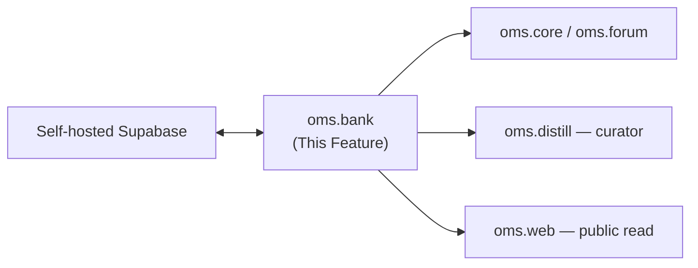

---
tags:
  - documentation
  - oh-my-swarm
  - knowledge-curation
---

## Status

- **Lifecycle:** Planned — schema extended in the 2026-05-19 swarms-alignment pass.
- **Last reviewed:** 2026-05-19. Follows `Oh My Swarm - Design Principles.md`.
- Owns the data-model source of truth: the **append-only migration list**, not prose (Principles §3). The 3-role access model is **Settled** (datasmith-validated); this pass adds a `curator` identity, the `goal`/`post`/`distill` schema, and the **`injection` reuse ledger** that makes downstream-reuse the load-bearing curation signal.

## Abstract

`oms.bank` is the Knowledge Bank: the self-hosted Supabase client, the migration list defining the schema, typed storage, the four-identity access model, the PostgREST surface, packet quarantine, and the **downstream-reuse view**. Every module reads/writes through it.

## High level overview

## Access identities — **Settled (datasmith-validated + curator)**

Supabase-native auth + Postgres RLS, DB-enforced (datasmith's lesson: app-layer read-only leaked → it revoked the grant):

| Identity | Mechanism | Can |
|---|---|---|
| **public** | `anon` key | `SELECT` only, public set only (no raw `traces` bodies) |
| **trusted** | issued key, maintainer-distributed | `INSERT`/`UPDATE` sessions/agents/posts/traces |
| **admin** | `service_role` | full oversight; curation; quarantine; migrations |
| **curator** | scoped service identity (the **server** curator, `oms.distill`) | `SELECT` posts + `INSERT` `distill` packets; cannot delete or read raw `traces` beyond scrubbed posts |

`curator` is narrow on purpose: the hosted curator can only read posts and write bundles, so a compromised curator cannot exfiltrate raw traces or mutate the corpus. A `local` curator writes as the triggering `trusted` user instead.

## Schema (defined by the migration list)

Append-only, numbered. Prose is a rendering.

| # | Migration | Effect |
|---|---|---|
| `00001` | `initial_schema` | `sessions`, `agents`, `packets`, `traces` |
| `00002` | `packet_quarantine` | `packets.quarantined`, `quarantine_reason`, `auditor_version` |
| `00003` | `trace_scrub_meta` | `traces.scrub_version`, `traces.complete` |
| `00004` | `three_role_rls` | RLS; `public_read` policy; revoke broad anon; `trusted`/`admin` |
| `00005` | `preference` | `packets.preference`, `parent_attempt` |
| `00006` | `swarms_taxonomy` | `packets.type` ∈ `raw|post|distill`; add `kind`, `reply_to`, `stance`, `structured jsonb`, `rating smallint NULL`, `scope`, `bundle jsonb`, `parents text[]`, `curator`; `sessions.goal text`, `packets.goal text` |
| `00007` | `injection_ledger` | `injections(packet_id, target_session_id, injected_at)`; `curator` role + grants; `reuse_score` **view** |

Core tables:

| Table | PK | Purpose |
|---|---|---|
| `sessions` | `(id)` | `id`, `goal` (nullable), `created_at`, `status` |
| `agents` | `(id)` | `{session}/agent-{NNN}-{adapter}`, `session_id`, `adapter`, `seq` |
| `packets` | `(id)` | the `oms.core` shape: `type`, `goal`, `kind/reply_to/stance/structured/rating` (post), `scope/bundle/parents/curator/preference` (distill), `quarantined` |
| `traces` | `(packet_id)` | raw scrubbed traces; **not** public-readable; `scrub_version`, `complete` |
| `injections` | `(packet_id, target_session_id)` | every `/inject`: which packet entered which session, when |

### The reuse ledger — the load-bearing curation signal

`/inject` writes an `injections` row. `reuse_score` is a **view** (not a stored field — recomputable, so weighting improves retroactively without re-curation): for a packet, an aggregate over sessions it was injected into, weighted by those sessions' later `rating`/`distill.preference`. `oms.distill` reads this view to weight Insights (high reuse → confidence promotion; the behavioral analog of swarms cross-generation recurrence). This is implemented as the **default baseline** per the user's decision.

### Identity rule — **Settled (datasmith precedent)**

Canonical ids are tuples/strings owned here; never client-derived. `agents.seq` via atomic `next_agent_seq(session_id)` (transactional), never `max(seq)+1`.

### Concurrency — **Settled (closed-simple)**

ACID. Concurrent `/cross-distill` → two `distill` packets; consumers take the latest. No locking. (Open-Q §C7.)

### Quarantine — **Settled**

Poisoned/abused packets → `quarantined=True` (visible, excluded from curation/`/inject`), append-only, provenance kept. No-carry-forward (`oms.distill`) + no-history hardening (`oms.forum`) keep amplification detectable; a retro-quarantine of a `post` is reflected in the next curation because `bundle` carries `parents`.

## Operations & recovery

- **Migration verify:** `preflight` diffs the live DB against the migration list; `make bank-migrate` applies locally.
- **Reuse backfill:** `reuse_score` is a view → recomputable from `injections` + ratings; no re-curation needed to improve weighting.
- **Re-scrub / re-curate:** `traces.scrub_version` + bundle/anti-meta versions drive scripted backfills + retro-quarantine; append-only, no silent overwrite.
- **Curator key rotation:** the `curator` scoped identity is Supabase-managed; a leaked curator key is revoked DB-side and cannot have deleted or read raw traces (scope-limited by design).

## Verification

- **Unit:** retry wrapper; `put_*` idempotent; migrations apply from empty and are no-ops re-applied.
- **Integration (security, highest priority):** `anon` reads the public set but not `traces` bodies and cannot write (DB-enforced); `trusted` writes but cannot bypass RLS; `curator` can read posts + insert `distill` but **cannot** delete or read raw `traces`; `admin` can do both.
- **Integration:** an `/inject` writes an `injections` row; `reuse_score` rises for a packet injected into a later well-rated session and stays flat for an unused one; recomputing the view after a backfilled rating changes weighting without touching `distill` packets.
- **Integration:** concurrent `next_agent_seq` → distinct contiguous `NNN`; quarantining a `post` excludes it from the next curation's `parents`.

## Decision log

- **2026-05-19 — Schema migrations `00006`/`00007` (swarms-alignment):** `raw|post|distill` taxonomy + forum/curator subfields; `goal` on sessions/packets; `rating`; the `injections` ledger + `reuse_score` view.
- **2026-05-19 — Added the `curator` scoped identity** for the hybrid server curator — deliberately narrow (read posts / write bundles only) so a compromised hosted curator can't exfiltrate raw traces or mutate the corpus.
- **2026-05-19 — Downstream reuse implemented as a recomputable view, the default curation weight** (per user). Recomputability means the load-bearing signal improves retroactively without re-curation.
- **2026-06-09 — `make db-tunnel-*` exposes the Bank's Supabase HTTP API at `db.swarms.formulacode.org` (Cloudflare named tunnel).** Per user, a named `cloudflared` tunnel fronts `127.0.0.1:54421` so a remote `oms` can point `OMS_BANK_URL` at HTTPS. **Security caveat** (in `docs/guide/remote-access.md`): the local stack uses Supabase's default demo JWT secret (no `signing_keys_path` in `supabase/config.toml`), so the `service_role` key is *public* — the endpoint **must** be gated with Cloudflare Access and/or have its signing keys rotated before public exposure (the datasmith Access posture). Tunnel-only here; **no Bank schema/RLS change**. `db.swarms.*` is a two-level subdomain, so it also needs Total TLS / an Advanced Certificate (free Universal SSL covers one level).
