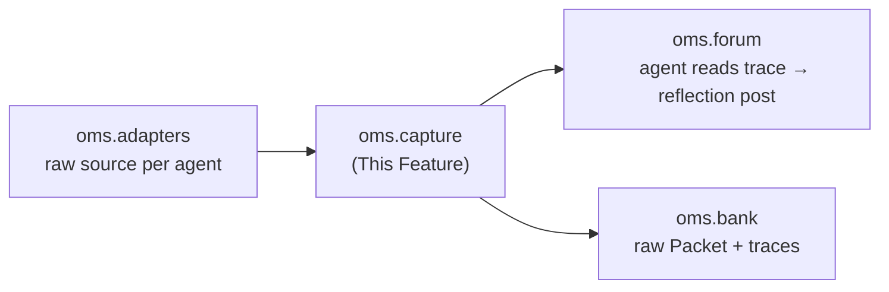

---
tags:
  - documentation
  - oh-my-swarm
  - knowledge-curation
---

## Status

- **Lifecycle:** Planned — *the invisible prerequisite* (see Design Principles §2).
- **Last reviewed:** 2026-05-19.
- Follows `Oh My Swarm - Design Principles.md`. This module did **not** exist in the first `oms` draft — `adapter.capture()` was one hand-waved line in `oms.adapters`. Elevated because `datasmith`'s largest module (`resolution/`) was likewise the *unplanned prerequisite* without which the headline feature was garbage-in/garbage-out.
- **2026-05-19 reframe:** the `CanonicalTrace` schema is a *contract* the **adapter author** conforms to (reviewed at PR time — `oms.adapters`, Open-Questions §C9); `oms.capture` no longer carries a central "parse arbitrary terminals" burden. Its load-bearing jobs narrow to **validate conformance, bound size, scrub, persist**. Secret scrub drops from Fragile-catastrophic to **defense-in-depth** because raw trace bodies are no longer in the public-read set (`oms.bank` 3-role model, migration `00004`). The one genuinely hard thing left is **bounding huge traces** (still Open).

## Abstract

This document covers `oms.capture` — turning a heterogeneous, possibly enormous, possibly secret-bearing agent session into a **normalized, size-bounded, secret-scrubbed, replayable trace** that `oms.distill` can consume and `oms.bank` can store. `oms.adapters` supplies the raw source; `oms.capture` owns everything between "raw bytes off some agent" and "a `raw` Packet safe to put in a public corpus."

## High level overview



## Motivation (the datasmith parallel)

In `datasmith`, `synthesize_images` could not work until `resolve_packages` pinned dependencies; the design assumed build scripts could be synthesized directly and was wrong. The resolution doc opens: *"Currently nothing populates these fields … making synthesis unreliable."*

`oms`'s exact analog: `oms.distill` cannot produce useful knowledge until the trace it summarizes is **faithful** (it actually reflects what happened), **bounded** (a 6-hour coding session does not fit a context window), **scrubbed** (a publicly-readable corpus must not ingest the user's API keys — defense-in-depth behind the 3-role read boundary), and **replayable** (provenance and audit require the raw, not just the summary). None of that is the adapter's job, and none of it is the distiller's job. It is a module.

## Responsibilities

1. **Validate conformance.** The adapter author emits `CanonicalTrace`-shaped material (their responsibility, PR-reviewed). `oms.capture` validates it against the schema and rejects/flags non-conformant traces — it does **not** heuristically parse arbitrary terminal output.
2. **Bound.** Enforce a size budget so distillation is tractable (chunking + a recency/importance-weighted reduction; see *Trace size* — the remaining hard problem).
3. **Scrub (defense-in-depth).** Remove credentials/obvious PII before persistence. Raw bodies are *not* publicly readable (`oms.bank` 3-role), so scrub is a second layer, not the only wall.
4. **Persist & replay.** Write the scrubbed raw trace as a `type='raw'` Packet (1:1 with `traces` in `oms.bank`) so any distillation is auditable and re-runnable.

## CanonicalTrace

```python
@dataclass
class TraceEvent:
    ts: float                 # monotonic offset from session start
    kind: str                 # "user" | "agent" | "tool_call" | "tool_result" | "system"
    text: str                 # already scrubbed
    truncated: bool = False   # set if this event was size-reduced

@dataclass
class CanonicalTrace:
    session_id: str
    agent_id: str
    adapter: str              # "claude" | "codex" | ...
    events: list[TraceEvent]
    source_fidelity: str      # "structured" (native logs) | "pty" (terminal tee)
    scrub_report: "ScrubReport"
    bytes_in: int
    bytes_out: int            # after bounding
```

`source_fidelity` is first-class: a claude/codex run yields a *structured* trace (turns, tool calls); a PTY tee yields raw bytes only. Downstream (`oms.distill`) must degrade gracefully on `"pty"` and never assume tool-call structure exists.

## Key Design Questions

### Trace size vs. context window — **Open (highest-risk)**

A long session's trace exceeds any local model's context. This is the single most likely place `oms` "explodes" the way `datasmith` exploded into `resolution/`. Candidate strategy, not yet committed: map-reduce — chunk the trace, summarize chunks, summarize the summaries — with structured traces chunked on turn boundaries and PTY traces on byte windows. Cost/latency budget per capture is unresolved. **This is owned here, not in `oms.distill`** so the distiller stays a pure summarizer.

### Secret scrubbing — **Settled as defense-in-depth (residual completeness Open)**

Primary protection is the access boundary, not the regex: `oms.bank` migration `00004` keeps raw `traces` bodies out of the public-read role (only `summary`/`metadata` are public). Scrub is the *second* layer: a regex pass for API-key shapes, `Authorization:`/`Bearer`, `.env`-style `KEY=value`, common cloud-credential formats; emits a `ScrubReport` (counts/kinds, never the secret); runs *before* persistence; `traces.scrub_version` enables a re-scrub backfill + retro-quarantine. Residual gap (novel formats; a `trusted` reader is still a reader) is **retained, narrowed** — Open-Questions §B3, not Tier-2-catastrophic anymore.

### Conformance is the adapter author's job — **Settled**

There is no central PTY-parsing heuristic. The adapter author maps their agent's output to `CanonicalTrace` and declares `source_fidelity` (`"structured"` for `claude`/`codex` native logs; `"pty"` for a `gemini`/`qwen` tee), and is reviewed on it at PR time (`oms.adapters`, Open-Questions §C9). `oms.capture` validates the schema and `oms.distill` branches on `source_fidelity` (no tool-call structure on `"pty"`). This is the entire reason for the OO schema: heterogeneity is absorbed by the (reviewed) plugin against a fixed contract, centrally and uniformly.

## Operations & recovery

(Design Principles §8 — datasmith shipped 8 recovery scripts that no design anticipated.)

- **Re-scrub backfill:** when a new secret pattern is added, a script must re-scrub all stored `raw` traces and quarantine any newly-detected leaks. The seam: scrub logic is pure and versioned (`scrub_version` on the `traces` row).
- **Corrupted/partial trace:** capture can be killed mid-session. A `raw` Packet records `complete: bool`; an incomplete trace is still distillable but flagged.
- **Observability:** emit `bytes_in`/`bytes_out`, `source_fidelity`, and `scrub_report` counts so corpus-wide leakage and truncation rates are monitorable.

## Verification

- **Offline:** each adapter's sample native trace normalizes to a `CanonicalTrace` with correct `source_fidelity`; round-trips through `oms.bank`.
- **Offline (security-critical):** a trace with injected fake credentials (OpenAI/Anthropic/AWS shapes, a `.env` block) is fully redacted before the `put_trace` call; the `ScrubReport` counts them and contains none of the secret material. This is the highest-priority test in the project (public corpus).
- **Offline:** bounding a synthetic 50 MB PTY trace produces a trace within budget, `truncated=True` on reduced events, and the map-reduce result is non-empty.
- **Offline:** a `"pty"` trace with no tool-call structure does not crash `oms.distill` (degradation path).
- **Online (gated):** end-to-end capture → distill on a real short session; assert fidelity and that re-running distillation from the stored raw trace reproduces an equivalent summary (replayability).

## Decision log

- **2026-05-19 — Created.** Extracted from `oms.adapters`'s one-line `capture()`. Rationale: Design Principles §2 (the invisible prerequisite). Direct datasmith precedent: `resolution/` was the unplanned module that became the largest subsystem because it was the true prerequisite for the headline feature. Predicting the same dynamic for trace capture/normalization in `oms`.
- **2026-05-19 — Scrub downgraded Fragile → defense-in-depth.** Cause: `oms.bank`'s 3-role model removed raw bodies from public read, so the access boundary (not the regex) is the primary control. Residual completeness retained, narrowed (Open-Questions §B3).
- **2026-05-19 — Normalization burden moved to adapter authors against the fixed schema** (Open-Questions §C9). `oms.capture` validates conformance; it does not parse arbitrary terminals. Removes the predicted "central heuristic explodes" risk for this module; the genuine remaining hard problem is trace **bounding**.
- **2026-05-19 (swarms-alignment) — Consumer is now `oms.forum`.** The scrubbed, bounded `CanonicalTrace` is what the agent reads at `/self-distill` to write its structured `reflection` post (the falsifiable claim), not a free-text self-summary fed to a distiller. `oms.distill` (the curator) consumes posts, not traces — so capture's contract is unchanged but its downstream is the agent-side forum step.

## Decision log (build additions)

- **2026-06-10 (M12.2) — `CanonicalTrace.term`: terminal geometry is part of the capture contract.** A user compared our viewer's replay of a freshly captured Claude Code run against a reference asciinema recording (`1031053.cast`, header `term: {cols: 159, rows: 37, …}`) — ours was "a mess" because the envelope carried no geometry and the cast header guessed 120x32: a TUI lays itself out for the real terminal width, and replaying at any other width wraps every box border. Settled: `CanonicalTrace` gains an optional ``term: dict | None`` field — ``{"cols", "rows", "resizes": [[offset_s, cols, rows], …]}`` — populated by the wrapper from the timing sidecar's size records (``oms.cli.md`` same date) and serialized into the stored envelope (``_serialize``); ``scrub``/``bound`` carry it untouched via ``dataclasses.replace``. ``None`` for legacy/non-PTY traces (the deserializing consumer must treat it as absent). This is an additive field on the frozen dataclass contract, not a behavioural change to validate→scrub→bound→persist.
