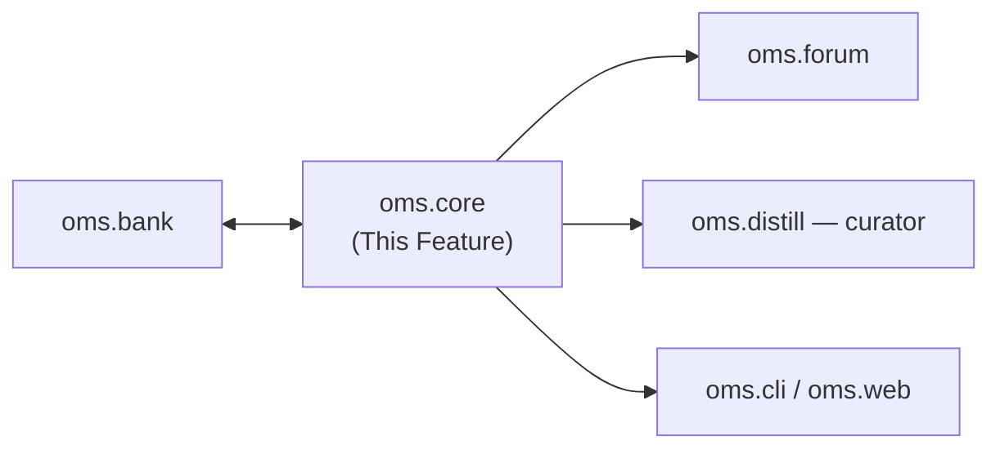

---
tags:
  - documentation
  - oh-my-swarm
  - knowledge-curation
---

## Status

- **Lifecycle:** Planned — reworked in the 2026-05-19 swarms-alignment pass.
- **Last reviewed:** 2026-05-19. Follows `Oh My Swarm - Design Principles.md` (incl. §11).
- Nouns are now **four**: `Session` (collaboration container), `Goal` (soft scope key — the `task` analog without a verifier), `Agent` (registered adapter instance), `Packet`. Packet taxonomy changed: `raw | post | distill` (was `raw | self-distill | cross-distill`).

## Abstract

`oms.core` is the model layer. Pydantic v2 frozen value objects; explicit async `.fetch()` hydration (no per-instance `__getattr__` — Design Principles §4). The 2026-05-19 changes add `Goal`, the swarms-aligned packet taxonomy, and the human/behavioral outcome fields.

## High level overview



## Nouns

- **`Session`** — a collaboration container several agents join (`oms start`; Alice shares the id with Bob). *Not* a task: no verifier, no solved-state. Unchanged in role.
- **`Goal`** — a **soft, optional, possibly agent-inferred** scope label. The swarms `task` analog *minus the oracle*: it scopes per-goal vs cross-goal curation and anchors the ★ rating. Set by `oms start --goal "..."`, inherited by the session's posts, or proposed by the agent at `/self-distill` (stored in `Packet.goal` / `Session.goal`). **Never gates anything** — open-endedness is preserved (a session may have no goal, one, or several over time).
- **`Agent`** — a registered adapter instance in a session; bookkeeping derived from its packets.
- **`Packet`** — `raw` | `post` | `distill` (below).

## Packet taxonomy (swarms-aligned)

```python
from pydantic import BaseModel, ConfigDict, field_validator
from datetime import datetime

class Packet(BaseModel):
    model_config = ConfigDict(frozen=True)

    id: str                     # "{session_id}/{uuid}"
    type: str                   # "raw" | "post" | "distill"
    agent_id: str | None        # canonical agent id, "online", "curator", or None
    goal: str | None = None     # soft scope label (None = ungoaled)
    created_at: datetime | None = None
    quarantined: bool = False

    # --- post (oms.forum) ---
    kind: str | None = None         # "reflection" | "reply"
    reply_to: str | None = None     # parent post id (reply)
    stance: str | None = None       # "agree" | "disagree" | "synthesize" (reply)
    structured: dict | None = None  # falsifiable post-mortem schema (oms.forum)
    rating: int | None = None       # 1..5 human ★; None = unrated (valid)

    # --- distill (oms.distill curator) ---
    scope: str | None = None        # "per_goal" | "cross_goal"
    bundle: dict | None = None      # 6 typed Insight buckets (oms.distill)
    parents: list[str] = []         # post ids this bundle was curated from
    curator: str | None = None      # "local" | "server"
    preference: str | None = None   # "accept" | "reject" | None (on distill)
    parent_attempt: str | None = None

    @field_validator("type")
    @classmethod
    def _t(cls, v: str) -> str:
        assert v in {"raw", "post", "distill"}, f"bad packet type {v!r}"
        return v

    @classmethod
    async def fetch(cls, id: str) -> "Packet":
        """Hydrate from oms.bank (cache → API). Explicit; the Overview REPL
        elides the await. Bare `oms.Packet(id)` does no I/O."""

    @property
    def session_id(self) -> str: return self.id.split("/")[0]
    @property
    def agent(self) -> "Agent | None": ...   # real | "online" | "curator" | None
    def to_record(self) -> "KnowledgePacket": ...
```

Mapping to the verbs: `/self-distill` → `post(kind=reflection)`; `/discuss` → `post(kind=reply, stance, reply_to)`; `/cross-distill` → `distill(scope, bundle, parents, curator)`; `/inject` → consumes a `distill`. The old `self-distill`/`cross-distill` *packet types* are superseded — see `components/archived/`.

## Outcome model (settled with the user 2026-05-19)

Three distinct signals, deliberately not conflated (swarms gets them free from one evaluator; OMA gets them from different acts):

- **`rating`** (1–5★, on a `post`/session) — *how the work went*. Optional, **unrated is a first-class valid state**, asked only at accept-time / `oms end`, non-blocking. The agent proposes a value from the trace; the human one-taps confirm or override (the override is itself signal). Used as a soft within-goal prior, bucketed high/med/low — never a global number (`oms.distill`).
- **`preference`** (`accept`/`reject`, on a `distill`) — *artifact quality*. The existing loop, generalized; rejected attempts retained as negative preference data.
- **downstream reuse** — *the load-bearing default signal*: a packet that was `/inject`ed into a later session that was then rated/accepted well. Behavioral, hard to game; computed by an `oms.bank` view over `injection` records (not a field on `Packet`).

## Collections, identity, hydration — **Settled (unchanged)**

`session.agents` / `session.packets` are one generic `Collection[T]` (`list/get/search(regex)/remove/__getitem__`). `goal` adds `session.posts(goal=...)` / `bank.posts(goal=...)` filtered accessors. Frozen value objects, identity by `id`. `Agent.start_date/end_date` derived from its posts. `quarantined` is a first-class non-hiding field; consumers (`oms.distill`/`oms.web`) decide exclusion.

## Verification

- **Unit:** `type` validator accepts only `raw|post|distill`; a `reply` requires `reply_to`+`stance`; a `distill` requires `scope`+`bundle`; `rating` ∈ {None,1..5}; `goal=None` is valid everywhere (open-endedness).
- **Unit:** bare construction does no I/O; `.fetch()` hydrates and memoizes; identity-by-id holds across hydrations; quarantined packets remain in `session.packets`.
- **Integration (mock Bank):** round-trip a `reflection`, a stance `reply` (with `reply_to`), and a per-goal `distill` (with `parents`); `session.posts(goal=g)` returns only that goal's posts; an ungoaled session's posts are still listed.

## Decision log

- **2026-05-19 — Packet taxonomy → `raw|post|distill`** (swarms-alignment). `post`/`distill` carry the forum/curator subfields. Old `self-distill`/`cross-distill` types archived.
- **2026-05-19 — Added the `Goal` noun** — soft, optional, agent-inferrable, never gating; the `task` analog without a verifier (resolves the long-running "is a session a task?" thread: no — `goal` is the scope key, `session` stays the collaboration container).
- **2026-05-19 — Added the triple outcome model** (`rating` field + `preference` + behavioral downstream-reuse view). `rating` optional/unrated-valid/agent-proposed; reuse is the load-bearing default signal per the user.
- **2026-05-19 (M6 build, C1) — `preference` made mechanically distill-only.** The model validator was previously permissive: nothing stopped `preference` on a `post`. Per `:70`/`:98` (`preference` is on a `distill`) and `oms.forum.md:89` (a rejected `/self-distill` post is *not stored* — the agent is re-prompted; there is no `preference=reject` post), `_PacketFields._check_shape` now raises if `preference is not None and type != "distill"`. Defense-in-depth past the `oms.forum` parser, not a schema change — it tightens a previously-permissive validator to the always-intended invariant.
- **2026-05-19 (M9 build) — `Agent.start_date/end_date` (`:103`) realized as a no-I/O builder.** Added `Agent.from_activity(row, *, packets=…)`: a pure classmethod that derives the span — `start` = the earliest of the agent's registration time and its packet timestamps; `end` = its **last packet** (final activity), falling back to `start` when it produced nothing (a registration timestamp is a start event and can never bound the *end* of activity). The `oms.web` `GET /s/{session}/agents` route fetches the agent + packet rows and hands them here, so the route stays a dumb orchestrator and the derivation lives in the frozen model (Design Principles §3/§4). Faithful to `:103` ("derived from its posts"), widened to *packets* — a `raw`/`reply` also bounds activity. Two optional `datetime` fields (`start_date`/`end_date`, default `None`) added; populated only by this builder, so a bare `Agent(id=…)` is unchanged.
</content>
- **2026-05-20 — `Agent.created_at` surfaced as a first-class field.** The `agents` table has stored `created_at` since `00001_initial_schema`, but `Agent`'s `extra="ignore"` dropped it; only the derived `start_date`/`end_date` (M9) reached the wire. Adding `created_at: datetime | None = None` is purely additive (matches `Session.created_at`) — `from_activity` now passes it through. Distinct from `start_date`, which *collapses* registration + first-packet time; `created_at` is the canonical DB-assigned registration timestamp. Driven by the new `oms.web` `/s/{session}/a/{agent}` deep link (see `oms.web.md` 2026-05-20).
