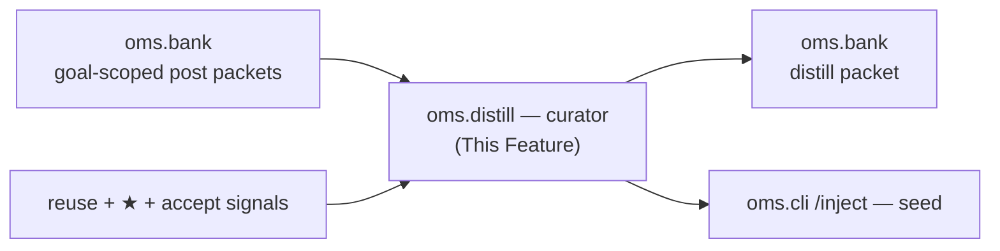

---
tags:
  - documentation
  - oh-my-swarm
  - knowledge-curation
---

## Status

- **Lifecycle:** Planned — reworked in the 2026-05-19 swarms-alignment pass.
- **Last reviewed:** 2026-05-19. Follows `Oh My Swarm - Design Principles.md` (incl. §11).
- **`/self-distill` is no longer a distiller.** It produces a structured `reflection` post (`oms.forum`). The actual distiller is a **curator** over the substrate's structured posts, emitting the swarms 6-bucket evidence-grounded Insight schema. Curator runs in **hybrid** mode: local (user's LLM) *or* server (hosted), both supported.

## Abstract

`oms.distill` is the **curator**: it reads goal-scoped `post` packets (`oms.forum`) and emits a `distill` packet — a structured, evidence-grounded, scarce bundle of Insights for future agents to be seeded with. It is not the worker agent self-summarizing; it is a separate curator LLM over collective evidence (swarms `runtime/llm.py` + `distillation/`). Open-Q §A1 (the prompt design) is **resolved** — specified directly from `swarms/distillation/prompts.py`.

## High level overview



## The Insight schema (Open-Q §A1, resolved)

A `distill` packet's `bundle` (jsonb) has six typed lists; each item is an **Insight** (`swarms/distillation/types.py:15-35`, `prompts.py:124-178`):

```json
{
  "text": "<the rule, 'when X do Y' — concrete, ≤240 chars>",
  "applies_when": "<concrete condition it holds>",
  "does_not_apply_when": "<concrete boundary; NOT 'always'/'never'/'n/a' — an unbounded rule is rejected>",
  "evidence": [{"post_id": "<real packet id>", "quote": "<verbatim ≤200-char excerpt from that post>"}],
  "confidence": "high | medium | low"
}
```

Buckets: `transferable_insights`, `confirmed_constraints`, `rejected_hypotheses`, `pitfalls`, `checks`, `next_steps`. `rejected_hypotheses` (what NOT to try) is first-class signal, not an afterthought.

**Mechanical validation (not trusted to the model):** the parser drops any Insight without non-empty `text`/`applies_when`/`does_not_apply_when`/`evidence`; drops `evidence` whose `post_id` is not in the real cited-post set; rejects a paraphrase (the verbatim `quote` must literally appear in the cited post); enforces caps (≤5 per bucket) regardless of model output (`per_task.py:284-340`). Empty buckets are correct and preferable to filler.

## The anti-meta discipline (the empirical core)

The single `ANTI_META_BLOCK` constant (shared byte-identical with `oms.forum`, CI-tested) is rendered into the curator's system prompt. Its basis is the swarms finding (`distillation/prompts.py:7-16`, `concreteness.py:3-6`): an unguided cross-scope bundle measured **~74–95% generic process meta-advice**, and because the transferable layer is the payload, *that noise was what transferred*. The curator therefore (a) bans enumerated meta phrases, (b) requires a concrete primitive per Insight, (c) requires a verbatim evidence quote, (d) caps quantity. This is most of the validated benefit and is **adopted as-is** — pure prompt+parser, independent of every fork.

The curator system prompt is cache-split (stable rules/schema prefix + variable per-call posts) — the rule block is huge and identical across calls, so cost forces the split (`prompts.py:475-501`). `OMS_`-tunable; the prompt constants live in `oms.distill` (Design Principles §8).

## Scoping: per-goal and cross-goal (not self/cross)

The old self/cross-session axis is replaced by swarms' per-task/cross-task axis, adapted to OMA's soft `goal` (`oms.core`):

- **per-goal distill** — input = all `post` packets under one `goal` (across sessions/agents). Output = a per-goal `distill` packet.
- **cross-goal distill** — input = posts that generalize across goals (the corpus-wide transferable layer OMA previously lacked). Output = a cross-goal `distill` packet.

These are **structurally independent** (no cross-leak between the two inputs) and a `distill` packet **never feeds back** into a later curation (no carry-forward — consumed only at `/inject` time). Both invariants are swarms V2 (`distiller.py:56-63,92-94`); they prevent echo amplification.

## Outcome / confidence model

OMA has no objective evaluator, so swarms' `native_score` is replaced by a triple (settled with the user 2026-05-19):

| Signal | Source | Use |
|---|---|---|
| **downstream reuse** (load-bearing, **default baseline**) | a `post`/`distill` was `/inject`ed into a later session that was then rated/accepted well (`oms.bank` reuse view) | the trusted weight — behavioral, hard to game; analog of swarms' cross-gen recurrence |
| **★ progress rating** (soft within-scope prior) | optional human 1–5★; agent proposes, human one-tap confirms; **unrated is valid** | bias only, never a gate; within-goal/bucketed (high/med/low), never a global number |
| **accept/reject** | human, on a `distill` packet | artifact-quality preference data (the existing loop, generalized) |

Curator weighting: high-reuse / ≥4★ authors win conflicting claims and get `confidence` promotion; ≤2★ or contradicted claims become `rejected_hypotheses`/`pitfalls`; unrated = neutral (swarms' no-score behavior — still curated, just unweighted); a primitive independently cited by posts across sessions under a goal → `high` (recurrence). Never produce a global numeric ranking; ★ from different goals are not comparable.

## Hybrid curator (settled)

Both modes supported; `OMS_CURATOR_MODE` ∈ `local` | `server` | `auto` (`oms.utils`):

- **local** — `/cross-distill` runs the curator prompt on the user's own LLM over the goal-scoped posts. Preserves "OMA ships no inference for the user's task"; user pays; bounded by goal+time clustering (`oms.utils` `OMS_CROSSDISTILL_WINDOW_DAYS`); works with no server.
- **server** — an optional hosted curator (a `curator` identity in `oms.bank`'s role model) periodically re-distills the public corpus per goal. Consistent, continuous, best quality. Reframing (Design Principles §6 corollary): curating the *public corpus* is not being the user's *task* inference provider — OMA already hosts the Bank/API, so this is consistent, not a violation.
- **auto** — server if reachable, else local. The corpus is usable degraded (local-only) and better with the server.

## State machine (`/cross-distill`)

```
1. posts = cluster(goal, window)              # per-goal or cross-goal scope
   → if zero posts under scope, abort "Run /self-distill first!"
2. if a fresh distill packet already covers exactly these posts → return it (no spend)
3. curator = resolve(OMS_CURATOR_MODE)        # local LLM | server | auto
4. bundle = curator(ANTI_META_SYSTEM, render(posts, reuse/★ weights))
5. bundle = validate(bundle, real_post_ids)   # mechanical drop/cap; never trust the model
6. put distill Packet(scope, goal, parents=[post ids], curator=mode); return viewer URL
```

Idempotent/resumable; a killed run writes nothing partial and re-runs reproducibly from the stored posts.

## Operations & recovery

- **Rate-limit mid-run** — local curator hits the user's budget; `oms.utils.provider.rate_limit_signal` seam; idempotency makes a paused run recoverable (still Open — Open-Q §B).
- **Reuse backfill** — the downstream-reuse signal is computed by an `oms.bank` view over the `injection` records; recomputable, so weighting improves retroactively without re-curation.
- **Prompt/validator versioning** — the anti-meta block and parser carry versions; a script can re-curate; append-only, never silent overwrite; no-carry-forward keeps re-curation honest.

## Verification

- **Offline (mock curator):** the parser drops an Insight with an invented `evidence.post_id`, a paraphrased (non-verbatim) quote, or `does_not_apply_when="always"`; enforces ≤5/bucket regardless of model output.
- **Offline:** per-goal and cross-goal curation use structurally independent inputs (no cross-leak); a `distill` packet is never an input to a later curation (no carry-forward).
- **Offline:** weighting — a claim from a high-downstream-reuse post beats a conflicting claim from an unrated post; a ≤2★ claim lands in `rejected_hypotheses`/`pitfalls`; unrated posts are still curated.
- **Offline:** `OMS_CURATOR_MODE=local|server|auto` selects the correct curator; `auto` falls back to local when the server is unreachable; zero posts → exact `"Run /self-distill first!"`.
- **Online (gated):** end-to-end forum→curate→inject on a fixture goal; bundle is non-empty, every Insight's quote is verbatim-present in a cited post, re-curating from stored posts reproduces an equivalent bundle.

## Decision log

- **2026-05-19 — Reworked as the curator (swarms-alignment).** `/self-distill` → a `reflection` post (`oms.forum`). Adopted the 6-bucket evidence-grounded Insight schema, the shared anti-meta block, mechanical parser validation, no-carry-forward + per/cross independence, cache-split prompt. Open-Q §A1 resolved (specified from `swarms/distillation/prompts.py`).
- **2026-05-19 — self/cross-session axis replaced by per-goal/cross-goal** (`oms.core` `goal`). Recovers the corpus-wide transferable layer OMA lacked.
- **2026-05-19 — Outcome model = downstream-reuse (default baseline) + ★ (soft prior) + accept/reject.** Replaces `native_score`; reuse is behavioral and the load-bearing weight per user decision.
- **2026-05-19 — Hybrid curator (local|server|auto).** Per user decision; server reframed as corpus-curation, not user-task inference (Design Principles §6 corollary).
- **2026-05-19 (M7 build) — curator parser is port + harden (C3); swarms→oms `Evidence` remap; idempotency-key refinement; §11 curator corollary (C4).** The mechanical bundle parser (`oms.distill.parse`) ports the *mechanical-not-trusted-to-the-model* philosophy of `swarms/distillation/per_task.py:_as_insight_list:284-340` and **hardens** it: the two rules `:53` requires be mechanical were prompt-level only in swarms (`distillation/prompts.py:163-169`) and are now enforced in the parser — **C3-ADD #1** `does_not_apply_when` ∈ {empty, `always`, `never`, `n/a`, `na`, `none`} ⇒ the Insight is dropped (an unbounded rule is rejected); **C3-ADD #2** each `evidence[].quote` must be a whitespace-normalized **verbatim** substring of the cited post or the entry is dropped (a paraphrase loses the Insight its grounding ⇒ dropped). swarms→oms `Evidence` remap: swarms `post_id:int` + `task_id` (+ `allowed_post_ids: set[int]`) → oms `post_id` = packet-id **string**, no `task_id`, resolved against the real clustered post-id **string** set (the M7 analog of the M6/C3 forum `Evidence` remap). Anti-meta enforcement reuses the **same code** as the M6 post parser: `CONCRETE_RE`/`is_concrete`/`has_banned_meta` were lifted into `oms.forum.anti_meta` (single source of truth) and both parsers import them — the rule the curator filters against is byte-for-byte the rule the agent wrote against *at the level of code*, not just the shared `ANTI_META_BLOCK` text (no behavioural change to M6; M6 suite re-verified green). Cross-session **recurrence promotion** (`:80`) is mechanical: an Insight whose surviving evidence cites posts from ≥2 distinct sessions is forced `confidence=high` past the model. **Idempotency-key refinement:** the deterministic `distill` id (`curator/{sha256 of scope + goal + sorted(parent_ids)}`) is keyed on scope+goal+posts **only — not the curator mode**; folding the mode in would make an `auto` run that fell back server→local re-spend on re-run, violating state-machine step 2 (":97" "covers exactly these posts → return it (no spend)") and the resumability invariant (`:102`). The concrete executor is still recorded on the `curator` field for provenance. A *directly*-quarantined `distill` is still returned by step 2 with its `quarantined` flag intact: the input is unchanged so re-curation lands the SAME content-addressed id and silently overwriting it violates `:92` (append-only, no silent overwrite), so the consumer decides exclusion (`oms.core.md`: `quarantined` is a non-hiding first-class field; `/inject`'s Settled human preview gate is the protection layer). Retro-quarantine of a *parent post* is the path that yields a fresh curation — the excluded post changes the parent set ⇒ a different content-addressed id (`oms.bank.md:86`/`:100`), handled automatically by `_cluster(include_quarantined=False)`. C4: the §11 curator corollary (a hosted curator over the *public corpus* is corpus-curation, not the user's *task* inference provider — structure is an agent/curator tax, never a human tax) is cited in the `oms.distill.server`/`oms.distill.resolve` docstrings — no behavioural change.
- **2026-05-19 (M10 build, C2) — the one intentional Fragile recorded: `poison_check`.** Per Design Principles §9:48, after the 2026-05-19 resolution pass exactly **one** Key Design Question remains **Fragile by design** — the *automated* poisoned-packet heuristic. It is named here so the Risks ledger is not silently complete (C2: this doc's Operations/Verification omitted it). **v1 ships no automated detector** — the heuristic is deliberately optional/deferred (Open-Q §A2, folded into the empirical items). The Fragile sits behind **three already-Settled layers**, all implemented and tested: (1) `oms.distill` excludes `quarantined` packets from every curation input (`_cluster(include_quarantined=False)` for both per/cross scope — `:103`/`:105`; a retro-quarantined parent changes the content-addressed id so re-curation is automatic); (2) **no-carry-forward** — a `distill` is never an input to a later curation, so a poisoned bundle cannot launder itself into the corpus; (3) the `/inject` **human preview gate** (`oms.cli` M8: head/tail token preview + explicit `[y/n]`, quarantined refused *before* preview, `OMS_NONINTERACTIVE`⇒deny) is the load-bearing protection before any cross-session context transfer. The seam for a future v1 heuristic is `oms.distill` feeding `oms.bank.quarantine(...)` — it would flag, not delete (`:92` append-only; `quarantine` is a non-hiding first-class field, `oms.core.md`), and every layer above already honors the flag, so adding the detector is additive and requires no schema or seam change. No behavioural change in M10; this entry is the §3 doc-sync that closes C2.
