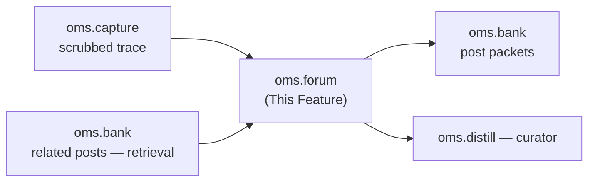

---
tags:
  - documentation
  - oh-my-swarm
  - knowledge-curation
---

## Status

- **Lifecycle:** Planned — new in the 2026-05-19 swarms-alignment pass.
- **Last reviewed:** 2026-05-19. Follows `Oh My Swarm - Design Principles.md` (incl. §11, swarms-validated).
- This is the "swarm" primitive. Distilled knowledge is only as good as its input; the swarms codebase proves the input must be **structured, falsifiable, evidence-grounded posts produced under an anti-meta discipline**, not free-text self-summaries (`swarms/discussion/forum_prompt.py`, `swarms/discussion/concreteness.py`). OMA cannot run swarms' synchronous multi-round container forum, so the forum here is **asynchronous and Bank-backed**: the swarm emerges across sessions and time, not within a generation.

## Abstract

`oms.forum` is the write-time contribution discipline: every knowledge contribution is a `post` packet carrying a **structured, falsifiable, evidence-grounded** body, optionally threaded as a stance-tagged reply. The discipline is generated **by the agent** (the CLI tool already has the session in context), not the human — Design Principles §11. The curator (`oms.distill`) consumes posts; it never consumes raw self-summaries.

## High level overview



## The post packet

A `post` (a `Packet` with `type="post"`, see `oms.core`) has:

- `kind` ∈ `reflection` (about the author's own session, from `/self-distill`) | `reply` (a stance-tagged response to another post, from `/discuss`).
- `reply_to` — parent post id (`reply` only). `stance` ∈ `agree` | `disagree` | `synthesize` (`reply` only).
- `goal` — the soft scope label (see `oms.core`); inherited from the session or agent-inferred.
- `structured` (jsonb) — the **falsifiable post-mortem schema**, agent-generated:

```json
{
  "load_bearing_assumption": "<the ONE assumption the work relied on; if it failed, what was wrong; concrete — names a specific tool/API/file/data-shape/invariant, not 'be careful'>",
  "evidence": "<verbatim 1-3 sentence excerpt from this session's trace OR a cited prior post; not a paraphrase>",
  "evidence_ref": "<packet id of the cited prior post, or null if grounded in own trace>",
  "proposed_next": "<ONE concrete change a future agent should try; names a file/tool/API/decision-point; differs from what was tried>",
  "predicted_outcome": "<a falsifiable prediction of what happens if proposed_next is applied>",
  "confidence": "high | medium | low"
}
```

This is swarms' per-task post-mortem schema (`forum_prompt.py:668-675`) adapted: "a falsifiable claim, not a summary."

## Write-time discipline (the anti-meta block)

`oms.forum` and `oms.distill` import one **byte-identical** `ANTI_META_BLOCK` constant (single source of truth, CI-tested — mirrors `swarms/discussion/concreteness.py`). It is rendered into the agent-side post prompt *and* the curator prompt so the rule the agent writes against is the rule the curator filters against. The rule, in brief: a contribution is rejected unless it (1) names a concrete primitive (operation/API/file/error/flag — abstract nouns like "structure"/"approach" are rejected), (2) is bounded, (3) is grounded in a verbatim quote from the trace or a real cited post, (4) is scarce (caps; "empty is better than filler"). Generic process advice ("validate first", "decompose", "check edge cases") is explicitly banned by enumerated phrase — it is the empirically-measured failure payload, not merely low value.

Enforcement is **mechanical, not trusted to the model**: `oms.forum`'s parser drops a post whose `evidence_ref` is not a real packet id, whose `evidence` is empty, or whose required fields are missing — exactly as `swarms/distillation/per_task.py:_as_insight_list` validates `allowed_post_ids` and enforces caps regardless of model behavior.

## Verbs

- `/self-distill [guidance]` → the agent reads its own scrubbed trace and emits one `reflection` post under the discipline. (This is what `/self-distill` *is* now — swarms' Phase-1 reflection, not a free-text summary.)
- `/discuss [@packet] [--stance agree|disagree|synthesize]` → **new verb.** The agent first *retrieves* related posts from the Bank (retrieval-before-post is mandatory — the agent must read context before contributing, mirroring swarms' `query`/`knowledge`-before-`forum_post` guard), then emits one `reply` post engaging a specific prior post. A reply that engages a real prior post is weighted above a standalone reflection by the curator (swarms' "round-1 > round-0").

`/discuss` with no `@packet` lets the agent pick the most useful under-engaged post for its `goal`.

## Key Design Questions

### Async, not synchronous rounds — **Settled**

Humans drive heterogeneous agents at arbitrary times; there is no generation barrier. "Rounds" collapse to temporal order + reply depth. "Round-1 > round-0" becomes "a `reply` that engaged a real prior post carries more curator weight than a standalone `reflection`." Cross-session recurrence (the same concrete primitive cited by independent posts under a goal) → confidence promotion, exactly as swarms promotes cross-generation recurrence.

### Structure is an agent tax, never a human tax — **Settled (Design Principles §11)**

The practitioner taps accept/reject and an optional ★. The structured JSON, the retrieval-before-post, the anti-meta self-check are all in the *agent-side skill prompt* `oms` injects, run by the CLI tool that already holds the session. This is the single constraint that lets the open-ended loop survive.

### Forge protection — **Settled**

Agent-emitted text is sanitized so a post body cannot forge the post protocol or a citation (mirrors `swarms/discussion/forum_prompt.py:_sanitize_agent_output`). No-history hardening: when a `goal` has no prior posts, the agent prompt explicitly forbids citing post ids ("do not reference prior posts — none exist"), because hallucinated citations otherwise get curated into bundles and amplified (`forum_prompt.py:620-634`). Ties to `oms.distill` no-carry-forward and `oms.bank` quarantine.

## Verification

- **Offline:** a `reflection` post missing `load_bearing_assumption` or with an `evidence_ref` to a non-existent packet is rejected by the parser (not stored); a post with a banned meta phrase and no concrete primitive is flagged low/dropped.
- **Offline:** `/discuss` is refused until the agent has retrieved ≥1 related post (retrieval-before-post guard); a `reply` with `reply_to` to a quarantined packet is refused.
- **Offline:** under a `goal` with zero prior posts, a generated post citing any `evidence_ref` is rejected (no-history hardening).
- **Offline:** forge attempt — a trace containing a literal protocol/citation block does not produce a forged post.
- **Online (gated):** end-to-end `/self-distill` then `/discuss` on a fixture session yields two well-formed posts; the reply's `stance` and `reply_to` resolve.

## Decision log

- **2026-05-19 — Created (swarms-alignment).** The forum is the swarm; without it `/cross-distill` curates the wrong substance. Async/Bank-backed because OMA has no synchronous generation barrier. Adopted swarms' falsifiable post-mortem schema, the shared anti-meta block, mechanical parser validation, retrieval-before-post, forge/no-history hardening. Added the `/discuss` verb. Structure is agent-side only (Design Principles §11).
- **2026-05-19 (M6 build) — parser is port + harden; swarms→oms `Evidence` mapping; §11 (C4).** `ANTI_META_BLOCK` is byte-identical to `swarms/discussion/concreteness.py:20-51` (single object; `oms.distill` M7 imports the same one — identity, not equality). The parser ports the *mechanical-not-trusted-to-the-model* philosophy of `swarms/distillation/per_task.py:_as_insight_list` and **hardens** it for oms: swarms' `evidence_post_id: int` (+ `task_id`) becomes oms's `evidence_ref`: a packet-id **string**, no task (the M6 analog of the C3 swarms→oms `Evidence` remap); plus Bank-grounded checks swarms had no analog for (`evidence_ref` resolves via `bank.get_packet`, no-history scoped to the `goal`, quarantine refusal). The `/discuss` retrieval-before-post guard is a documented process-local gate keyed by `(session_id, agent_id)` (swarms enforced it server-side; oms's CLI orchestrates `/discuss`→reply in one process). C4: §11 (structure is an agent tax, never a human tax) is cited in the `oms.forum` module/skill-prompt docstrings — no behavioural change.
